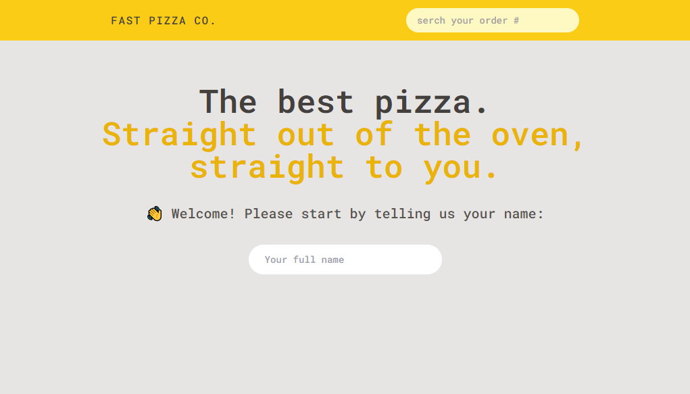
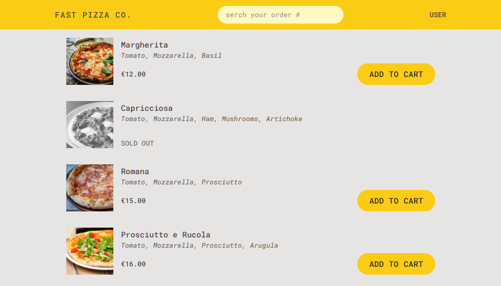

<h1 align="center" style="font-weight: bold;">Fast Pizza 💻</h1>

<p align="center">
 <a href="#tech">Tecnologias</a> •
 <a href="#started">Iniciando</a> 

</p>

<p align="center">
    <b>O FastPizza é um aplicativo que simula um serviço de delivery de pizzas. Desenvolvido com React e Redux, ele oferece uma experiência interativa e moderna para os usuários, permitindo a seleção e personalização de pizzas, adição ao carrinho e finalização do pedido.</b>
</p>

<p align="center">
     <a href="https://jota-fast-pizza.netlify.app/">📱 Live</a>
</p>

<h2 id="layout">🎨 Layout</h2>

<p align="center">
    
    
</p>

<h2 id="tech">💻 Tecnologias</h2>

- React
- Redux
- React-router-dom
- Tailwind

<h2 id="started">🚀 Iniciando</h2>

<h3>Pré-requisitos</h3>

- [NodeJS](https://github.com/)

<h3>Clonando</h3>

Como clonar o projeto:

```bash
git clone https://github.com/ivanfrancajunior/fast-pizza.git
```

<h3>Iniciando</h3>

Como iniciar o projeto:

```shell
cd fast-pizza
npm install
npm run dev
```